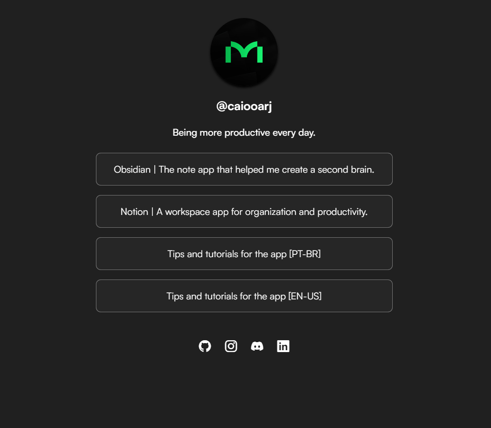
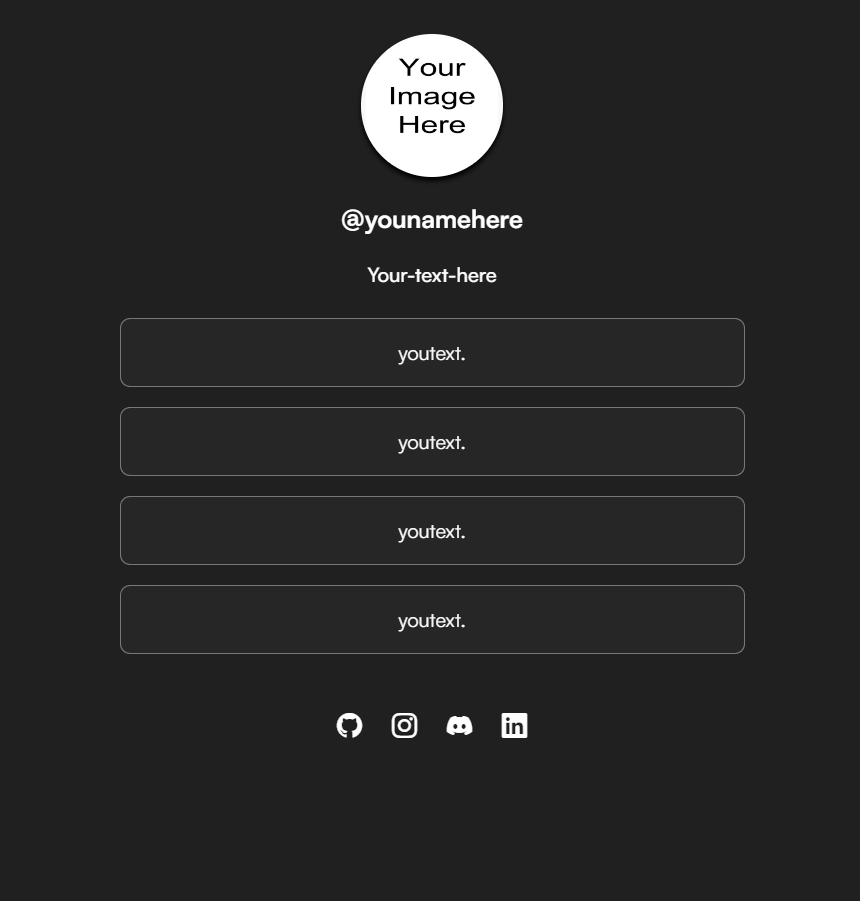

<h1 align="center">A simple copy of the linktree </h1>

 just a quick project made to test a little about styles 

 
 

## Technologies used

- HTML and CSS
- A little bit of JavaScript 
- (look the commits to get the dlc..)

## About

I was thinking of a simple project where you can practice CSS styles, and maybe a little JavaScript. So, I made this one and even used Bootstrap to see how it worked (I had never used it before).

Don't forget to look at the commits :)

## 

<footer align="center"> 
<a href="https://www.linkedin.com/in/caioestanislau/" target="_blank">That's it, thanks for your attention.</a>

 ↑ don't forget to check   ↑ 

</footer>